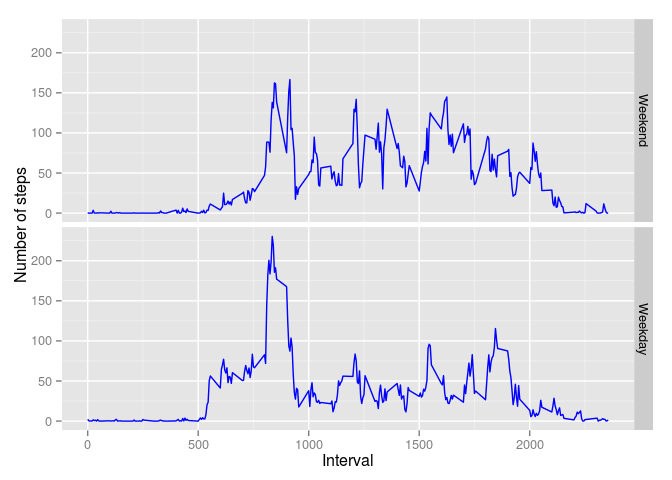

# Reproducible Research: Peer Assessment 1


## Loading and preprocessing the data

Unzipping and loanding the dataset into memory


```r
unzip("activity.zip")
data <- read.csv("activity.csv")
head(data, n = 3)
```

```
##   steps       date interval
## 1    NA 2012-10-01        0
## 2    NA 2012-10-01        5
## 3    NA 2012-10-01       10
```


## What is mean total number of steps taken per day?

First, we are going to use the ``aggregate`` function to obtain the total number of steps by day. For this part of the assignment we can ingnore missing values.


```r
stepsDay <- aggregate(steps ~ date, data = data, FUN = sum, na.rm = TRUE, na.action = NULL)
head(stepsDay, n = 3)
```

```
##         date steps
## 1 2012-10-01     0
## 2 2012-10-02   126
## 3 2012-10-03 11352
```


1. Make a histogram of the total number of steps taken each day


```r
hist(stepsDay$steps, breaks = 15, col = "deepskyblue3", main = "Total number of steps by day",
     xlab = "Number of steps")
```

 


2. Calculate and report the **mean** and **median** total number of steps taken per day


```r
summary(stepsDay$steps)[3:4]
```

```
## Median   Mean 
##  10400   9354
```


## What is the average daily activity pattern?

1. Make a time series plot (i.e. `type = "l"`) of the 5-minute interval (x-axis) and the average number of steps taken, averaged across all days (y-axis)


```r
stepsInterval <- aggregate(steps ~ interval, data = data,FUN = mean, na.rm = TRUE,
                           na.action = NULL)
```


```r
plot(stepsInterval, type = "l", main = "Average number of steps by interval",
     xlab = "Interval", ylab = "Number of steps")
```

 


2. Which 5-minute interval, on average across all the days in the dataset, contains the maximum number of steps?


```r
intervalMax <- which.max(stepsInterval$steps)
stepsInterval$interval[intervalMax]
```

```
## [1] 835
```


## Imputing missing values

Note that there are a number of days/intervals where there are missing
values (coded as `NA`). The presence of missing days may introduce
bias into some calculations or summaries of the data.

1. Calculate and report the total number of missing values in the dataset (i.e. the total number of rows with `NA`s)


```r
missingIndex <- is.na(data$steps) 
missingValues <- sum(missingIndex)
missingValues
```

```
## [1] 2304
```


2. Devise a strategy for filling in all of the missing values in the dataset. The strategy does not need to be sophisticated. For example, you could use the mean/median for that day, or the mean for that 5-minute interval, etc.

We are going to use the mean of the number of setps by interval to replace the `NA` values.


```r
groups <- split(data, data$interval)

for(i in (1:288)) {
        index <- is.na(groups[[i]]$steps)
        average <- mean(groups[[i]]$steps, na.rm = TRUE)
        groups[[i]]$steps[index] <- average
        groups
}
```


3. Create a new dataset that is equal to the original dataset but with the missing data filled in.


```r
library(plyr)

DF <- ldply(groups, data.frame)
DF <- DF[,c(2:4)]
head (DF, n = 3)
```

```
##      steps       date interval
## 1 1.716981 2012-10-01        0
## 2 0.000000 2012-10-02        0
## 3 0.000000 2012-10-03        0
```


4. Make a histogram of the total number of steps taken each day and Calculate and report the **mean** and **median** total number of steps taken per day. Do these values differ from the estimates from the first part of the assignment? What is the impact of imputing missing data on the estimates of the total daily number of steps?


```r
newStepsDay <- aggregate(steps ~ date, data = DF, FUN=sum, na.rm=TRUE, na.action = NULL)
```


```r
hist(newStepsDay$steps, breaks = 15, col = "deepskyblue3", main = "Total number of stpeps by day",
     xlab = "Number of steps")
```

 

As can be seen in the previos histogram, after the imputation of missing values the distribution of the steps taken by day seems to be more normal-like. In addition, the imputation changes the values of **mean** and **median**. As can be seen below, in the new dataset the **mean** and the **median** have the same value.


```r
summary(newStepsDay$steps)[3:4]
```

```
## Median   Mean 
##  10770  10770
```

## Are there differences in activity patterns between weekdays and weekends?

1. Create a new factor variable in the dataset with two levels -- "weekday" and "weekend" indicating whether a given date is a weekday or weekend day.


```r
DF$date <- as.Date(DF$date)
DF$day <- weekdays(DF$date)
DF$day[DF$day %in% c("Saturday", "Sunday")] <- "Weekend"
DF$day[DF$day %in% c("Monday", "Tuesday", "Wednesday", "Thursday", "Friday")] <- "Weekday"
DF$day <- factor(DF$day, levels = c("Weekend", "Weekday"))
head(DF, n = 3)
```

```
##      steps       date interval     day
## 1 1.716981 2012-10-01        0 Weekday
## 2 0.000000 2012-10-02        0 Weekday
## 3 0.000000 2012-10-03        0 Weekday
```

2. Make a panel plot containing a time series plot (i.e. `type = "l"`) of the 5-minute interval (x-axis) and the average number of steps taken, averaged across all weekday days or weekend days (y-axis).


```r
newDF <- aggregate(steps ~ interval+day, data = DF, FUN=mean, na.rm=TRUE, na.action = NULL)
```


```r
library(ggplot2)

g <- ggplot(newDF, aes(interval, steps))
p <- g+ geom_line(color = "blue") + facet_grid(day~.) + labs(x="Interval", y="Number of steps")
print(p)
```

 


